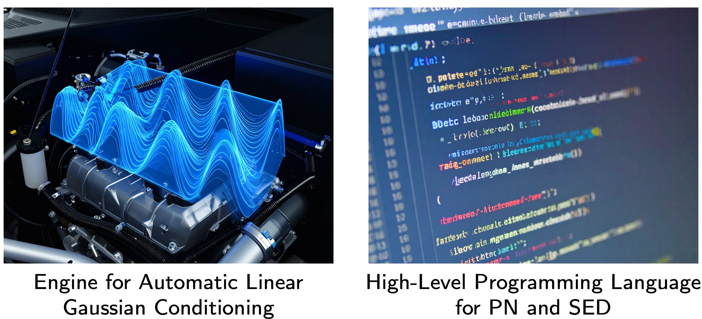

# What is this about?


```{python}
#| echo: False
import jax
from jax import config
import jax.numpy as jnp
from jax import Array
import numpy as np
config.update("jax_enable_x64", True)  # do this at the very top

import matplotlib.pyplot as plt

from tueplots import bundles, figsizes

plt.rcParams.update(bundles.probnum2025())
plt.rcParams.update(figsizes.probnum2025_half())

# plt.rcParams["figure.figsize"] = (5, 3)
plt.rcParams["text.usetex"] = True
plt.rcParams["font.family"] = "serif"
plt.rcParams["font.serif"] = ["Computer Modern Roman"]  # matches LaTeX default


from gaussed.domains import Euclidean
from gaussed.domains.index import IndexDomain
from gaussed.codomains import Codomain

from gaussed.gp.gp_ops.base import KernelSpec, FunSpec
from gaussed.gp.gp_ops.point_eval import Eval
from gaussed.gp.gp_ops.partial import Partial
from gaussed.gp.gp_ops.grad import Grad
from gaussed.gp.gp_ops.affine import Affine
from gaussed.gp.gp_ops.weighted_eval import WeightedEval
from gaussed.gp.gp_ops.probe import Probe, ProbeStack, as_stack
from gaussed.gp.gp_ops.linearise import Linearise

from gaussed.gp.kernels.rbf import RBFKernel, RBFParams
from gaussed.gp.kernels.matern import MaternKernel, MaternParams
from gaussed.gp.kernels.imq import IMQKernel, IMQParams
from gaussed.gp.kernels.delta import DeltaKernel, DeltaParams
from gaussed.gp.kernels.stacked import StackedKernel
from gaussed.gp.kernels.coregional import CoregionParams, CoregionalKernel
from gaussed.gp.means import ZeroMeanFun
from gaussed.gp.base import GP, PosteriorGP

from gaussed.model import GPModel
from gaussed.utils.shape_helpers import pack_ev2mat

from gaussed.backends.base import ExactBackend
from gaussed.backends.solvers.linear_solver import SolverFns
from gaussed.backends.solvers.cholesky import (
    chol_solve_hook,
    chol_sqrt_hook,
    chol_logdet_hook,
)
from gaussed.backends.solvers.svd import svd_solve_hook, svd_sqrt_hook, svd_logdet_hook

from gaussed.likelihoods.gaussian import GaussianLikelihood
from gaussed.likelihoods.gaussian_noise import DiagonalNoise

solver_fns = SolverFns(svd_solve_hook(), svd_sqrt_hook(), svd_logdet_hook())
```


<!-- ## What is this about? {.incremental} -->

::: {.unmarked}
::: {.incremental}
- **Desiderium:** Uncertainty in numerics should come with low additional overhead.
- **But:** Closed-form expressions for conditioning are limited.
- **And so**: Most PN is rooted in linear Gaussian (process) conditioning.
- **Idea:** An engine for automatic linear Gaussian conditioning, coupled to a high-level programming language for PN.

::: {.aside-right}
- we present a proof of concept
:::

- **Opportunity 1:** Could rapidly attempt de novo tasks with PN (and beyond).

::: {.aside-right}
- we demonstrate an application to x-ray tomography
:::

- **Opportunity 2:** Could automate sequential experimental design (SED)

::: {.aside-right}
- we propose a general-purpose acquisition function
:::

- **The result:** A Python package called `GaussED`.

::: {.aside-right}
- `https://github.com/MatthewAlexanderFisher/GaussED`
:::

:::
:::

## `GaussED`: A Proof-of-Concept

{fig-align="center" width=60%}


## An Engine for Automatic Linear Gaussian Conditioning

**Aim:**  Avoid tedious analytical calculations for each pair of linear operator and kernel.

::: {.unmarked}
::: {.incremental}
- **Step 1:** Construct a common basis over compact $\mathcal{X} \subseteq \mathbb{R}^d$:
$$
\begin{align*}
    -\Delta \phi_i(x) & = \lambda_i \phi_i(x), & \quad & x \in \mathcal{X}, \\
    \phi_i(x) & = 0, & \quad & x \in \partial \mathcal{X}.
\end{align*}
$$
e.g. for $\mathcal{X} = [0,1]^d$, $\phi_{j}(x) = \prod_{i=1}^d \sin\left(\pi j_i x_i\right)$, where $j = (j_1,\ldots,j_d) \in \mathbb{Z}^d$.

- **Step 2:**  Represent the kernel in the new basis:
$$ 
\begin{align*}
\textstyle k(x,y) \approx \sum_i \sum_j K_{i,j} \phi_i(x) \phi_j(y)
\end{align*}
$$
e.g. for translation-invariant $k$ (Solin and Sarkka, 2019).
$$
\begin{align*}
    \textstyle k(x,y) = \frac{1}{(2\pi)^d}\int s(\omega) \exp\left(i \langle \omega, x - y\rangle \right) \, \mathrm{d}\omega \implies
    k(x,y) \approx \sum_j s\left(\sqrt{\lambda_j}\right) \phi_j(x)\phi_j(y).
\end{align*}
$$

- **Step 3**  Represent linear functionals in the new basis:
$$
\begin{align*}
\textstyle L \left( \sum_i c_i \phi_i \right) = \sum_i c_i L(\phi_i) \approx \sum_i c_i \sum_j L_{i,j} \phi_j
\end{align*}
$$
e.g. for $L = \Delta$ have $L \phi_i = - i^2 \phi_i$ where $\phi_i(x) = \sin(\pi i x)$.

::: {.aside-right}
- $\therefore$ the linear operator and the kernel are decoupled
:::

:::
:::

## `GaussED`: A Proof-of-Concept

{fig-align="center" width=50%}


## Sequential Experimental Design (`gaussed/sed`)

**Aim:** Avoid tedious searching for good acquisition function for each new task.

::: {.fragment}
**Set-up:**

- (truth) $\mathrm{f}: \mathcal{X} \rightarrow \mathbb{R}^D$.
- (prior) $\mathbb{P}$, e.g. a Gaussian process, supported on $\mathcal{F}$.
- (design set) $\mathcal{D} \subset \{\text{continuous linear functionals on } \mathcal{F}\}$.
- (data) $\boldsymbol{\delta}_{n-1}(\mathrm{f}) = [\delta_1(\mathrm{f}), \ldots, \delta_{n-1}(\mathrm{f})] \in \mathbb{R}^{D\times (n-1)}$
:::

::: {.fragment}
**Sequential Experimental Design:** At iteration $n$, select an experiment $\delta_n$ from the design set in order that an *acquisition function* is maximised
$$
\delta_n \in \arg\max_{\delta \in \mathcal{D}} A(\delta; \mathbb{P}, \boldsymbol{\delta}_{n-1}(\mathrm{f})).
$$

e.g. expected improvement for Bayesian optimisation.
:::

::: {.fragment}
::: {.aside-right}
but what if we don’t know a good acquisition function $A$?
:::
:::

## A General-Purpose Acquisition Function
::: {.unmarked}
::: {.incremental}
- **Idea:** Use classical but overlooked ideas from Bayesian decision theory!
- **Step 1:** An acquisition function from a utility function. The \emph{expected utility} acquisition function is
$$
A(\delta; \mathbb{P} ,  \boldsymbol{\delta}_{n-1}(\mathsf{f})) =  \int \underbrace{ U(\boldsymbol{\delta}_{n-1}(\mathsf{f}), \delta(\mathrm{f}) ) }_{\text{utility function}} \; \mathrm{d}\mathbb{P}(\mathrm{f} | \boldsymbol{\delta}_{n-1}(\mathsf{f}) )
$$
where $\mathbb{P}(\cdot | \boldsymbol{\delta}_n(\mathsf{f}) )$ denotes the conditional distribution given the observed data $\boldsymbol{\delta}_n(\mathsf{f})$.

- **Step 2: a utility function from a loss function** The \emph{negative Bayes' risk} utility function
$$
\begin{equation} \tag{1}
   U(\boldsymbol{\delta}_{n-1}(\mathsf{f}), \delta(\mathrm{f}) ) = - \min_{\mathrm{g} \in \mathcal{F}} \int \underbrace{ L(\mathrm{g},\mathrm{g}') }_{\text{loss function}} \; \mathrm{d}\mathbb{P}(\mathrm{g}' | \boldsymbol{\delta}_{n-1}(\mathsf{f}) , \delta(\mathrm{f}) ) , \label{eq: U bayes risk}
\end{equation}
$$
i.e. the negative expected loss when the Bayes decision rule $\mathrm{g}$ is used.

::: {.aside-right}
- So just need to pick a task-specific loss function $L$.
- But (1) seems to involve optimisation?
:::

:::
:::

## Tractability of Acquisition Function

Consider a loss function of the form $L(\mathrm{f},\mathrm{g}) = \|q(\mathrm{f}) - q(\mathrm{g})\|^2$.

::: {.unmarked}
::: {.incremental}
- Under mild conditions, (1) is equal to
$$
\begin{align*}
    - \frac{1}{2} \iint  L(\mathrm{g},\mathrm{g}') \; \mathrm{d}\mathbb{P}_f(\mathrm{g} | \boldsymbol{\delta}_{n-1}(\mathsf{f})  , \delta(\mathrm{f})  ) \; \mathrm{d}\mathbb{P}_f(\mathrm{g}' | \boldsymbol{\delta}_{n-1}(\mathsf{f}) , \delta(\mathrm{f}) ) .
\end{align*}
$$

- Thus, from the law of total probability, 
$$
\begin{align*}
    A(\delta; \mathbb{P}_f ,  \boldsymbol{\delta}_{n-1}(\mathsf{f})) =  - \frac{1}{2} \iint L(\mathrm{g},\mathrm{g}') \; \mathrm{d}\mathbb{P}_f(\mathrm{g}' | \boldsymbol{\delta}_{n-1}(\mathsf{f})  , \delta(\mathrm{g})  ) \; \mathrm{d}\mathbb{P}_f( \mathrm{g} | \boldsymbol{\delta}_{n-1}(\mathsf{f})  ). 
\end{align*}
$$

::: {.aside-right}
- $\therefore$ the acquisition function $A$ (and its gradient) can be unbiasedly estimated.
- (squared error loss is `wlog' since $q(\cdot)$ is general)
:::

:::
:::


# Examples

## Probabilistic Solution of PDEs

**Task:** Solve the PDE
$$
\begin{alignat*}{2}
    \Delta \mathsf{f}(x) &= \mathsf{g}(x), &&\qquad x \in \mathcal{X} = [-1,1]^2, \\
    \mathsf{f}(x) &= 0, &&\qquad x \in \partial\mathcal{X}
\end{alignat*}
$$

with limited queries to $\mathsf{g}(\cdot)$.

::: {.fragment}
**Implementation in** `GaussED`:

```python
key = jax.random.PRNGKey(0)

domain = Rectangle(lo=jnp.array([-1., -1.]), hi=jnp.array([1., 1.])) 
codomain = Codomain((1,))
mean = ConstantMeanFun()
kernel = IMQ()

gp = GP(domain, codomain, mean, kernel)
measurement = Measurement((Laplace(),),  Eval) 

acq = BayesRisk(qoi = gp, measurement, key=key)
sed = SED(acq, g)

sed.run(n = 150)
```
:::


## Probabilistic Solution of PDEs

**Task:** Solve the PDE
$$
\begin{alignat*}{2}
    \Delta \mathsf{f}(x) &= \mathsf{g}(x), &&\qquad x \in \mathcal{X} = [-1,1]^2, \\
    \mathsf{f}(x) &= 0, &&\qquad x \in \partial\mathcal{X}
\end{alignat*}
$$

with limited queries to $\mathsf{g}(\cdot)$.

**Results:** 

{fig-align="center" width=85%}


## Tomographic Reconstruction

**Task:** Reconstruct a latent function $\mathsf{f}:\mathcal{X} \rightarrow\mathbb{R}$, where $\mathcal{X} = [-1,1]^d$, using line-integral data of the form
$$
\begin{equation*}
    \delta(\mathsf{f}) =  \int_a^b \mathsf{f}(r(t))\left|r'(t)\right| \, \mathrm{d}t,
\end{equation*}
$$
where $r(t)$, $t \in [a,b]$, is a parameterisation of a line with endpoints $r(a), r(b) \in \partial \mathcal{X}$. 

::: {.fragment}

**Results:** (32 lines of code in `GaussED`)

{fig-align="center" width=85%}

:::


## Gradient Based Bayesian Optimisation

**Task:**  Find the maximum likelihood estimator for parameters $(\alpha,\beta)$ of a noisily observed ODE model with limited calls to the ODE.

$$
\begin{equation*}
    \delta(\mathsf{f}) =  \int_a^b \mathsf{f}(r(t))\left|r'(t)\right| \, \mathrm{d}t,
\end{equation*}
$$
where $r(t)$, $t \in [a,b]$, is a parameterisation of a line with endpoints $r(a), r(b) \in \partial \mathcal{X}$. 

::: {.fragment}
::: {.unmarked}
**Approach:** Model the log-likelihood, $\mathsf{f} = \log \mathcal{L}(\alpha,\beta)$, as a GP, and take:  

- ▶ quantity of interest $q(\mathsf{f}) = \max_{x \in\mathcal{X}} \mathsf{f}(x)$
- ▶ design set $\mathcal{D}$ contains pointwise evaluation of $\mathcal{L}$ and $\nabla \mathcal{L}$.

:::
:::

## Gradient Based Bayesian Optimisation

**Task:**  Find the maximum likelihood estimator for parameters $(\alpha,\beta)$ of a noisily observed ODE model with limited calls to the ODE.

$$
\begin{equation*}
    \delta(\mathsf{f}) =  \int_a^b \mathsf{f}(r(t))\left|r'(t)\right| \, \mathrm{d}t,
\end{equation*}
$$
where $r(t)$, $t \in [a,b]$, is a parameterisation of a line with endpoints $r(a), r(b) \in \partial \mathcal{X}$. 


**Results:** (17 lines of code were required in `GaussED`)

![*Gradient-Based Bayesian Optimisation:* (a) Mean of $f | \boldsymbol{\delta}_n(\mathsf{f})$, the posterior after $n=90$ total evaluations. (b) Log-likelihood $\mathsf{f}$, with design points overlaid.  Colour indicates the order in which points were selected in SED. (c) Maximum value of the likelihood obtained during the first $m$ iterations of each optimisation method. (d) Location of the maximum value along the optimisation path, where the coloured $✖$ symbols indicate the maximum value obtained.](bo.png){fig-align="center" width=85%}


# Final Remarks

:::{.unmarked}
:::{.incremental}
- **Proof-of-Concept:** An engine for automatic linear Gaussian conditioning, coupled to a high-level programming language for PN. ✓
- **But:** GaussED is not (yet) at a stage of development where you should use it! Solutions ‘On the Market’:

  - ▶ PPLs for conditioning GPs on function value data (e.g. Rasmussen and Nickisch, 2010; Matthews et al., 2017)
  - ▶ Rainforth (2017, Chapter 11) and Ouyang et al. (2016); Kandasamy et al. (2018), who provided a high-level PPL for Bayesian SED.
  - ▶ For numerics, the ProbNum Python library (ProbNum, 2021)!
  - ▶ Paleyes et al. (2019) developed a PPL called Emukit, in which computer model emulation, Bayesian optimisation, and a number of probabilistic numerical methods are automated.
  
- **Thank you for your attention!**
:::
:::


## References {.scrollable}

:::{.unmarked}
- **Gunter, T., Osborne, M. A., Garnett, R., Hennig, P., and Roberts, S. J.** (2014). Sampling for inference in probabilistic models with fast Bayesian quadrature. *Advances in Neural Information Processing Systems*, **27**:2789–2797.
- **Kandasamy, K., Neiswanger, W., Zhang, R., Krishnamurthy, A., Schneider, J., and Poczos, B.** (2018). Myopic Bayesian design of experiments via posterior sampling and probabilistic programming. *arXiv:1805.09964.*
- **Matthews, A. G. d. G., Van Der Wilk, M., Nickson, T., Fujii, K., Boukouvalas, A., León-Villagrá, P., Ghahramani, Z., and Hensman, J.** (2017). GPflow: A Gaussian process library using tensorflow. Journal of Machine Learning Research, 18(40):1–6.
- **Ouyang, L., Tessler, M. H., Ly, D., and Goodman, N.** (2016). Practical optimal experiment design with probabilistic programs. *arXiv:1608.05046.*
- **Paleyes, A., Pullin, M., Mahsereci, M., Lawrence, N., and González, J.** (2019). Emulation of physical processes with Emukit. In *Proceedings of the 2nd Workshop on Machine Learning and the Physical Sciences, NeurIPS*.
- **ProbNum** (2021). ProbNum: Learn to approximate. Approximate to learn. www.probabilistic-numerics.org.
- **Rainforth, T. W. G.** (2017). Automating inference, learning, and design using probabilistic programming. PhD thesis, University of Oxford.
- **Rasmussen, C. E. and Nickisch, H.** (2010). Gaussian processes for machine learning (GPML) toolbox. *The Journal of Machine Learning Research*, 11:3011–3015.
- **Solin, A. and Särkkä, S.** (2019). Hilbert space methods for reduced-rank Gaussian process regression. *Statistics and Computing*, 30(2):419–446

:::


# `GaussED` Design

## Package Structure {.scrollable}

```{mermaid, fig-align="center", out-width=60%}
%%{init: {
  "flowchart": { "useMaxWidth": true, "nodeSpacing": 20, "rankSpacing": 160 },
  "themeVariables": { "fontSize": "24px", "fontFamily": "Iosevka, Times, serif" }
}}%%
graph TB

  %% --- GP construction ---
  subgraph GP_Definition["GP Definition"]
    Domain[Domain] --> GP
    Codomain[Codomain] --> GP
    Mean[MeanFun] --> GP
    Kernel[Kernel] --> GP
  end

  %% --- Operators / Probes ---
  subgraph GP_Operators["GP Operators"]
    Eval[Eval] --> Functional
    Functional[Functional] --> Probe
    Operator[Operator] --> Probe
    Partial[Partial] --> Operator
    Grad[Grad] --> Operator
    Linearise[Linearise] --> Operator
    Affine[Affine] --> Operator
    WeightedEval[WeightedEval] --> Functional
    Integral[Integral] --> Functional
    Probe --> ProbeStack
  end

  %% --- Model & posterior ---
  subgraph Model
    Likelihood --> GPModel
    GP --> GPModel
    ProbeStack --> GPModel
    GPModel -->|condition| PosteriorGP
  end


  %% --- Backend internals ---
  subgraph BackendGrp["Backend"]
    BackendNode[Backend] --> GPModel
    LinearSolver[Linear Solver] --> BackendNode
    BackendNode --> Reps["Exact / Inducing / Basis"]
    SpectralBasis[Spectral Basis] --> Reps
    Reps --> LinearSolver
  end

  ProbeStack -->|queries| PosteriorGP
  LinearSolver --> PosteriorGP
```


## Kernel Representations {.scrollable}

A kernel $k(x,y)$ defines the covariance structure of a GP.
There are multiple **representations** of $k$, each with different computational and modelling trade-offs:

### 1. **Exact (dense matrix form)**

* **Definition:** Explicitly materialise the Gram matrix

  $$
  K_{XX} = \big[k(x_i, x_j)\big]_{i,j=1}^n.
  $$
* **Use case:** Small–medium $n$ (up to a few thousand).
* **Pros:** Exact inference, numerically stable, minimal approximations.
* **Cons:** $\mathcal{O}(n^3)$ time, $\mathcal{O}(n^2)$ memory.


### 2. **Inducing Points (sparse / variational approximation)**

* **Definition:** Low-rank Nyström factorisation:

  $$
  K_{XX} \;\approx\; K_{XZ}\,K_{ZZ}^{-1}\,K_{ZX}, \quad |Z| = M \ll n.
  $$
* **Use case:** Large datasets, stochastic variational GPs, Bayesian optimisation.
* **Pros:** Cost $\mathcal{O}(nM^2)$; integrates with variational inference.
* **Cons:** Approximation depends on inducing point placement; extra parameters to optimise.

### 3. **Basis / Operator-centric**

* **Basis expansion (features):**
  E.g. By Bochner’s theorem, stationary kernels admit Fourier features:

  $$
  k(x,y) \;\approx\; \phi(x)^\top \phi(y), \quad \phi:\mathbb{R}^d \to \mathbb{R}^m.
  $$

  * Needs $m$ basis functions.
  * In high dimensions, $m$ typically scales **exponentially in $d$** → poor scalability.

* **Operator view:**
  Interpret $k$ as approximating the spectrum of a **self-adjoint operator** (e.g. Laplace, elliptic PDEs).

  * Example: Matérn kernels arise from the inverse of $(\alpha - \Delta)^{\nu}$.
  * Example: `SpectralBasis` of Solin and Sarkka (2019).

* **Pros:** Computationally efficient; ties to geometry/physics.

* **Cons:** Approximation error, scaling limits in high-dim.

### 4. **Structured Kernel Interpolation (SKI / KISS-GP)**

* **Definition:** Interpolate kernel values from a grid of inducing points:

  $$
  K_{XX} \;\approx\; W_X \, K_{UU} \, W_X^\top,
  $$

  where $U$ are grid points and $W_X$ are sparse interpolation weights.
* **Use case:** Very large $n$, especially when inputs lie on (or near) a grid.
* **Pros:** Exploits Kronecker/Toeplitz structure in $K_{UU}$; nearly linear scaling.
* **Cons:** Requires grid structure; approximation quality depends on interpolation.
Here’s a tightened, more polished version of that slide, highlighting the philosophy and concrete backends in a way that matches the style of your kernel-representation slide:

### `GaussED` Approach {.scrollable}

`GaussED` separates **kernel representation** from **operator semantics** via a `KernelRep` abstraction.

* This makes **operators and probes** work uniformly, regardless of whether the kernel is exact, approximate, or basis-based.
* Sequential Experimental Design (SED) interfaces directly with the representation layer — no special-casing needed.

#### Currently implemented backends

1. **`SpectralBasis`**
   – \[`gaussed/backends/basis/spectral_basis.py`]
   – Kernel represented through spectral decomposition / basis functions.

2. **Random Fourier Features (`RFF`)**
   – \[`gaussed/backends/basis/rff.py`]
   – Approximate stationary kernels via finite random Fourier basis.

3. **`ExactBackend`**
   – Dense matrix form, $\mathcal{O}(n^3)$ cost.
   – Reference implementation for small/medium $n$.

4. **`InducingBackend`**
   – Sparse variational/Nyström approximation with inducing points.
   – Scales to large $n$.

Backends are **pluggable**: swap between exact, inducing, or basis expansions while leaving operator/SED code unchanged.


# GP Operators (`gaussed/gp/gp_ops`)


## Math {.scrollable}

Starting with a Gaussian process

$$
f \;\sim\; \mathcal{GP}(m, k),
$$

where

* $f : \mathcal{X} \to \mathbb{R}^{D_1 \times \cdots \times D_r}$ is a random function taking values in a tensor space,
* $m:\mathcal{X}\to \mathbb{R}^{D_1 \times \cdots \times D_r}$ is the mean function,
* $k:\mathcal{X}\times\mathcal{X} \to \mathbb{R}^{(D_1 \times \cdots \times D_r)\times(D_1 \times \cdots \times D_r)}$ is the covariance kernel, giving block/tensor covariance between outputs.

### Conditioning on Functionals

We are often interested not in $f$ itself, but in **linear functionals** of $f$, e.g.

* point evaluations $f(x)$,
* partial derivatives $\frac{\partial}{\partial x_i} f(x)$,
* integrals $\int f(x)\,\mathrm{d}\mu(x)$,
* or any linear combination thereof.

Let $\delta$ denote a linear functional acting on $f$. Then

$$
\delta(f) = \int_\mathcal{X} L(x)\, f(x)\, \mathrm{d}x,
$$

for some tensor-valued kernel $L(x)$.

Since Gaussian processes are closed under linear maps,

$$
f \;\big|\; \delta(f) = \delta(\mathbf{f})
\;\;\sim\;\; \mathcal{GP}\big(m_\delta,\, k_\delta\big),
$$

where the conditional mean and covariance are obtained by the standard Gaussian conditioning rules.

### Linear Operators

We formalise this using **linear operators**

$$
\mathcal{L} : \mathcal{F}(\mathcal{X},\mathbb{R}^{D_1\times\cdots\times D_r})
\;\to\; \mathcal{F}(\mathcal{X},\mathbb{R}^{E_1\times\cdots\times E_s}),
$$

which map one tensor-valued function space to another. Examples:

* **Derivative operator:** $(\mathcal{L}f)(x) = \partial_{x_i} f(x)$,
* **Affine mixing:** $(\mathcal{L}f)(x) = A f(x) + b$ with $A \in \mathbb{R}^{E\times D}$,
* **Stacked outputs:** $(\mathcal{L}f)(x) = (f_1(x), f_2(x))$.

When combined with a functional $\delta$ (e.g. evaluation at a point), we obtain **probes**:

$$
\text{Probe} = (\mathcal{L}, \delta),
$$

which tells us how to transform $f$ before measurement.

### Covariances under Operators

If $f \sim \mathcal{GP}(m, k)$ and $\mathcal{L}, \mathcal{M}$ are linear operators, then

$$
\operatorname{cov}\!\big[ (\delta \circ \mathcal{L})(f),\, (\delta' \circ \mathcal{M})(f)\big]
= (\delta \otimes \delta')\big[\, (\mathcal{L} \otimes \mathcal{M}) k \,\big].
$$


## `GaussED` Operator Syntax {.scrollable}

`gp_ops` provides a small calculus for acting on GPs:

1. **Analytic hooks (optional).** You can register closed-form **linear pushforwards** of kernels/means (e.g. integrals, gradients). If a hook is missing, numerical routines in `OpContext` are used.
2. **Operators vs Functionals.**

   * An **`Operator`** maps a tensor-valued function $f:\mathcal{X}\to\mathbb{R}^{D_1\times \cdots \times D_k}$ to another function.
   * A **`Functional`** evaluates a function to a finite vector/array (e.g. point evaluation, integration), i.e. $\mathcal{F}\to\mathbb{R}^r$.
3. **Probes compose operators and functionals.**
   A **`Probe(ops, fnl)`** applies the tuple of `ops` (left-to-right) to the GP, then measures with `fnl`.


### Example: partial derivative then evaluate

```python
# Operators and functionals
partial_op = Partial(0)      # ∂/∂x₁ (an Operator)
eval_fnl   = Eval(X)         # evaluation at X (a Functional)

# Compose: (Eval ∘ ∂/∂x₁)
partial_probe = Probe((partial_op,), eval_fnl)
```

This probe represents the functional

$$
\left[\frac{\partial}{\partial x_1} f(x)\right]_{x \in X}
\in \mathbb{R}^{|X|\times m},
$$

i.e. the partial derivatives of each output at the points $X$.

### Kernels from probes

Given a `KernelSpec` `ks` and an operator context `ctx`, the Gram operator for two probes $F, G$ is

$$
K_{F,G} \;=\; \operatorname{cov}\!\big[F(f),\,G(f)\big].
$$

Compute auto- and cross-covariances via `.kernel`:

```python
# Auto-covariance (derivative–derivative)
K_dd = partial_probe.kernel(partial_probe, ks, ctx)

# Cross-covariances with plain evaluations at Y
other_probe = Probe((), Eval(Y))   # identity operator, then evaluate
K_dy = partial_probe.kernel(other_probe, ks, ctx)  # ∂/∂x₁ on the left
K_yd = other_probe.kernel(partial_probe, ks, ctx)  # ∂/∂x₁ on the right
```

Concretely, if $k$ is a scalar base kernel, then

$$
\big[K_{d,y}\big]_{ij} = \partial_{x_1} k(x_i, y_j),
\qquad
\big[K_{y,d}\big]_{ij} = \partial_{x_1} k(y_i, x_j).
$$

> **Note on shapes.** If the GP has $m$ outputs, the resulting blocks carry the output–output covariance structure. E.g. with a coregional ICM kernel, these are $m\times m$ blocks per $(i,j)$.


### What `ctx` (the `OpContext`) does

* Supplies **numerical fallbacks** (e.g. quadrature) when no analytic hook is registered for an operator–kernel pair.
* Provides **precision** and **backend** control for stable evaluation of mean and kernel pushforwards.


## `Eval` Functional {.scrollable}


### What it is

* **Functional:** $\mathrm{Eval}(X)$ maps a GP $f:\mathcal{X}\to\mathbb{R}^{m}$ to its values at inputs $X=\{x_i\}_{i=1}^n$.
* **As a probe:** $F = \text{Probe}(\,\varnothing,\, \mathrm{Eval}(X)\,)$.

### Meaning

$$
F(f) \;=\; \big(f(x_1),\ldots,f(x_n)\big)\in\mathbb{R}^{n\times m}.
$$

### Prior and posterior with noisy data

Given observations $y \in \mathbb{R}^{n\times m}$ with noise model $y = F(f) + \varepsilon$, $\varepsilon\sim\mathcal{N}(0,\Sigma_\varepsilon)$,

$$
\begin{aligned}
m_{\text{post}}(x_\star)
&= m(x_\star) \;+\; K_{x_\star X}\,(K_{XX} + \Sigma_\varepsilon)^{-1}\,(y - m(X)),\\[4pt]
k_{\text{post}}(x_\star,x_\star)
&= k(x_\star, x_\star) \;-\; K_{x_\star X}\,(K_{XX} + \Sigma_\varepsilon)^{-1}\,K_{X x_\star},
\end{aligned}
$$

where $K_{XX} = k(X,X)$, $K_{x_\star X} = k(x_\star,X)$.
(Shapes adapt block-wise for $m>1$.)

```{python}
#| fig-align: center
#| fig-width: 9       # inches for the matplotlib canvas
#| fig-height: 4.5
#| fig-dpi: 150
#| out-width: 80%     # CSS scale on the slide

# --- GP prior ---
domain   = Euclidean((1,))
codomain = Codomain((1,))
mean     = ZeroMeanFun(domain, codomain)
rbf_params = RBFParams(lengthscale=jnp.array(0.), amplitude=jnp.array(1.0))
kernel   = RBFKernel(rbf_params)
backend = ExactBackend(solverfns=solver_fns) 

gp = GP(domain, codomain, mean, kernel, backend)

# --- Data ---
key = jax.random.PRNGKey(0)
Xtr = jnp.linspace(-3.0, 3.0, 10).reshape(-1, 1)
y_clean = jnp.sin(Xtr).squeeze()
noise = 0.1
y = y_clean + noise * jax.random.normal(key, shape=y_clean.shape)

# --- Probes ---
Ftr = Probe(ops=(), fnl=Eval(Xtr))
Xt = jnp.linspace(-5.0, 5.0, 300).reshape(-1, 1)
Fte = Probe(ops=(), fnl=Eval(Xt))

# --- Model / condition ---
lik = GaussianLikelihood()
model = GPModel(gp=gp, likelihood=lik)
post = model.condition(Ftr, y)

# --- Prior mean/var (for reference) ---
prior_mean = gp.mean_spec().eval(Xt)[:, 0]
prior_var  = jnp.diag(pack_ev2mat(gp.kernel_spec().k0(Xt, Xt), (1,), (1,)))

# --- Posterior mean/var ---
m_post = post.mean(Fte)
v_post = post.variance(Fte)

```

```{python}
#| echo: False

# --- Plot ---
xplot = Xt.squeeze()

plt.figure(figsize=(10,5))

# Prior
plt.subplot(1,2,1)
plt.title("Prior GP (RBF)")
plt.fill_between(xplot,
                 prior_mean - 2*jnp.sqrt(prior_var),
                 prior_mean + 2*jnp.sqrt(prior_var),
                 alpha=0.3, label="$\\pm 2 \\sigma$")
plt.plot(xplot, prior_mean, "k--", label="Mean")
plt.scatter(Xtr.squeeze(), y, s=25, c="r", label="Data")
plt.legend()

# Posterior
plt.subplot(1,2,2)
plt.title("Posterior GP")
plt.fill_between(xplot,
                 m_post.reshape(-1,) - 2*jnp.sqrt(v_post),
                 m_post.reshape(-1,) + 2*jnp.sqrt(v_post),
                 alpha=0.3, label="$\\pm2\\sigma$")
plt.plot(xplot, m_post, label="Mean")
plt.scatter(Xtr.squeeze(), y, s=25, c="r", label="Data")
plt.legend()

# plt.tight_layout()
# mplcyberpunk.add_glow_effects()
plt.show()
```

### Why this matters

* **Baseline probe:** Everything else (derivatives, integrals, affine mixes) reduces to “operator then evaluate”.
* **Numerically stable:** Works with exact or iterative backends via `LinearOp`.

**Key takeaway:** `Eval` is the canonical measurement functional; posterior GP is obtained by the usual Gaussian conditioning with $F=\mathrm{Eval}(X)$.

## `Partial` Operator {.scrollable}

### What it is

* **Operator:** $\mathrm{Partial}(j)$ maps $f$ to $\partial_{x_j} f$.
* **As a probe:** $F^{(\partial)} = \text{Probe}((\mathrm{Partial}(j),),\, \mathrm{Eval}(X))$.

### Meaning

$$
F^{(\partial)}(f) \;=\; \Big(\tfrac{\partial}{\partial x_j} f(x_i)\Big)_{i=1}^n \in \mathbb{R}^{n\times m}.
$$

### Cross-covariances via operator calculus

For a scalar base kernel $k$,

$$
\begin{aligned}
\operatorname{cov}\!\big[\partial_{x_j} f(x),\, f(y)\big] &= \partial_{x_j} k(x,y),\\
\operatorname{cov}\!\big[\partial_{x_j} f(x),\, \partial_{y_\ell} f(y)\big] &= \partial_{x_j}\partial_{y_\ell} k(x,y).
\end{aligned}
$$

Thus the Gram for two probes is obtained by applying operators to $k$ **then** evaluating:

$$
K_{F^{(\partial)},\,G} \;=\; (\mathrm{Eval}\otimes \mathrm{Eval})\big[(\mathrm{Partial}(j)\otimes \mathcal{O}_G)\,k\big].
$$

### Conditioning on derivative data

Given noisy derivative observations $y^{(\partial)} \approx \partial_{x_j} f(X)$,

$$
\begin{aligned}
m_{\text{post}}(x_\star)
&= m(x_\star) + K_{x_\star,\,\partial X}\,\big(K_{\partial X,\partial X}+\Sigma_\varepsilon\big)^{-1}\!\big(y^{(\partial)} - m_{\partial}(X)\big),\\[4pt]
k_{\text{post}}(x_\star,x_\star)
&= k(x_\star,x_\star) - K_{x_\star,\,\partial X}\,\big(K_{\partial X,\partial X}+\Sigma_\varepsilon\big)^{-1}\,K_{\partial X,\,x_\star},
\end{aligned}
$$

with blocks like $K_{x_\star,\,\partial X} = \partial_{x} k(x_\star, X)$, $K_{\partial X,\partial X}=\partial_x\partial_y k(X,X)$.


```{python}
#| fig-align: center
#| fig-width: 9       # inches for the matplotlib canvas
#| fig-height: 4.5
#| fig-dpi: 150
#| out-width: 80%     # CSS scale on the slide

# --- GP prior ---
domain   = Euclidean((1,))
codomain = Codomain((1,))
mean     = ZeroMeanFun(domain, codomain)
imq_params = IMQParams(lengthscale=jnp.array(0.5), amplitude=jnp.array(1.24751754), beta=jnp.array(1.0))
imq_kernel   = IMQKernel(imq_params)
backend = ExactBackend(solverfns=solver_fns)

gp = GP(domain, codomain, mean, imq_kernel, backend)

# --- Data ---
key = jax.random.PRNGKey(0)
Xtr = jnp.linspace(-3.0, 3.0, 5).reshape(-1, 1)
y_clean = jnp.sin(Xtr).squeeze()
noise = 0.04
y = y_clean + noise * jax.random.normal(key, shape=y_clean.shape)

# --- Probes ---
Ftr = Probe(ops=(Partial(0),), fnl=Eval(Xtr))
Xt = jnp.linspace(-5.0, 5.0, 300).reshape(-1, 1)
Fte = Probe(ops=(), fnl=Eval(Xt))

# --- Model / condition ---
lik = GaussianLikelihood(noise=DiagonalNoise(jnp.array([0.01])))
model = GPModel(gp=gp, likelihood=lik)
post = model.condition(Ftr, y)

# --- Prior mean/var (for reference) ---
prior_mean = gp.mean_spec().eval(Xt)[:, 0]
prior_var  = jnp.diag(pack_ev2mat(gp.kernel_spec().k0(Xt, Xt), (1,), (1,)))

# --- Posterior mean/var ---
m_post = post.mean(Fte)
v_post = post.variance(Fte)

# --- Plot ---
xplot = Xt.squeeze()

plt.figure(figsize=(10,5))

# Prior
plt.subplot(1,2,1)
plt.title("Prior GP (IMQ)")
plt.fill_between(xplot,
                 prior_mean - 2*jnp.sqrt(prior_var),
                 prior_mean + 2*jnp.sqrt(prior_var),
                 alpha=0.3, label="$\\pm2\\sigma$")
plt.plot(xplot, prior_mean, "k--", label="mean")
plt.scatter(Xtr.squeeze(), y, s=25, c="r", label="Data")
plt.legend()

# Posterior
plt.subplot(1,2,2)
plt.title("Posterior GP")
plt.fill_between(xplot,
                 m_post.reshape(-1,) - 2*jnp.sqrt(v_post),
                 m_post.reshape(-1,) + 2*jnp.sqrt(v_post),
                 alpha=0.3, label="$\\pm2\\sigma$")
plt.plot(xplot, m_post, label="mean")
plt.scatter(Xtr.squeeze(), y, s=25, c="r", label="Data")
plt.legend()

plt.tight_layout()
# mplcyberpunk.add_glow_effects()

plt.show()

```


## `Grad` Operator {.scrollable}

We may want to condition a Gaussian process not only on **function values**  but also on their **gradients**.  
This is made possible by introducing the **gradient operator**:

$$
(\nabla f)(x) = \left( \frac{\partial f}{\partial x_1}(x), \ldots, 
                     \frac{\partial f}{\partial x_d}(x) \right)^\top .
$$

This is implemented in `GaussED` as the `Grad` operator.

### **Gradient conditioned on evaluations**  

 - Data: $f(X)$ observed.  
 - Posterior: joint distribution of $\{ f(X), \nabla f(X_*) \}$.  
 - Effect: gradients predicted consistently with observed values.  
  

```{python}

# ----------------------------
# GP prior (2D, with ARD)
# ----------------------------
domain   = Euclidean((2,))
codomain = Codomain((1,))
mean     = ZeroMeanFun(domain, codomain)

solver_fns = SolverFns(chol_solve_hook(), chol_sqrt_hook(), chol_logdet_hook())

backend = ExactBackend(solverfns=solver_fns)

# ARD lengthscales (ℓ_x, ℓ_y); amplitude = σ²
imq_params = IMQParams(
    lengthscale=jnp.array([1.0, 0.7]),  # ARD
    amplitude=jnp.array(1.0),
    beta=jnp.array(1.0),
)
kernel  = IMQKernel(imq_params)

gp      = GP(domain, codomain, mean, kernel, backend)

# ----------------------------
# Synthetic 2D data
# ----------------------------
key = jax.random.PRNGKey(0)
n_tr = 60
Xtr = jax.random.uniform(key, (n_tr, 2), minval=-3.0, maxval=3.0)

def f_true(xy: jnp.ndarray) -> jnp.ndarray:
    # smooth, non-separable target
    x, y = xy[..., 0], xy[..., 1]
    return jnp.sin(x) * jnp.cos(0.8 * y) + 0.2 * x

y_clean = jax.vmap(f_true)(Xtr)
noise   = 0.1
y       = y_clean + noise * jax.random.normal(key, shape=y_clean.shape)

# ----------------------------
# Probes
# ----------------------------
Ftr   = Probe(ops=(), fnl=Eval(Xtr))                 # function values at Xtr
lik   = GaussianLikelihood(noise=DiagonalNoise(jnp.array([0.01])))
model = GPModel(gp=gp, likelihood=lik)
post  = model.condition(Ftr, y)

# Test grid for visualisation
nx = ny = 60
x1 = jnp.linspace(-3.5, 3.5, nx)
x2 = jnp.linspace(-3.5, 3.5, ny)
Xg1, Xg2 = jnp.meshgrid(x1, x2, indexing="xy")
Xgrid = jnp.stack([Xg1.ravel(), Xg2.ravel()], axis=1)     # (nx*ny, 2)

F_eval  = Probe(ops=(), fnl=Eval(Xgrid))                  # function probe
F_grad  = Probe(ops=(Grad(), ), fnl=Eval(Xgrid))  # gradient probe (∂/∂x, ∂/∂y)

# Posterior mean and gradient mean
m_post_grid = post.mean(F_eval).reshape(nx*ny)            # (N,)
g_post_grid = post.mean(F_grad).reshape(nx*ny, 2)         # (N, 2)
```


```{python}
#| fig-align: center
#| fig-width: 9       # inches for the matplotlib canvas
#| fig-height: 4.5
#| fig-dpi: 120
#| out-width: 75%     # CSS scale on the slide
#| echo: false

# ----------------------------
# Plotting (two separate figures)
# ----------------------------
fig, axes = plt.subplots(1, 2, figsize=(9, 4.5))

# 1) Posterior mean as filled contours
ax = axes[0]
M = m_post_grid.reshape(ny, nx)
cf = ax.contourf(Xg1, Xg2, M, levels=25)
ax.scatter(np.array(Xtr[:, 0]), np.array(Xtr[:, 1]), s=15, c="k", alpha=0.6)
ax.set_title("Posterior Mean")
ax.set_xlabel("x")
ax.set_ylabel("y")
ax.set_aspect("equal", adjustable="box")

# 2) Gradient quiver (posterior mean gradient)
ax = axes[1]
G = g_post_grid.reshape(ny, nx, 2)
step = max(1, nx // 20)  # thin arrows for clarity
ax.quiver(
    Xg1[::step, ::step], Xg2[::step, ::step],
    G[::step, ::step, 0], G[::step, ::step, 1],
    angles="xy", scale_units="xy", scale=1.0
)
ax.scatter(Xtr[:, 0], Xtr[:, 1], s=10)
ax.set_title("Posterior Mean Gradient")
ax.set_xlabel("$x$")
ax.set_ylabel("$y$")
# ax.set_aspect("equal", adjustable="box")

plt.tight_layout()
# mplcyberpunk.add_glow_effects()

plt.show()
```


### **Evaluations conditioned on gradients**  
   - Data: $\nabla f(X)$ observed.  
   - Posterior: joint distribution of $\{ \nabla f(X), f(X_*) \}$.  
   - Effect: function values reconstructed from slope information.  

```{python}
#| fig-align: center
#| fig-width: 9       # inches for the matplotlib canvas
#| fig-height: 4.5
#| fig-dpi: 150
#| out-width: 80%     # CSS scale on the slide


# ----------------------------
# GP prior (2D, with ARD)
# ----------------------------
domain   = Euclidean((2,))
codomain = Codomain((1,))
mean     = ZeroMeanFun(domain, codomain)

solver_fns = SolverFns(svd_solve_hook(), svd_sqrt_hook(), svd_logdet_hook())
backend = ExactBackend(solverfns=solver_fns)

# ARD lengthscales (ℓ_x, ℓ_y); amplitude = σ²
imq_params = IMQParams(
    lengthscale=jnp.array([2., 1.9]),  # ARD
    amplitude=jnp.array(1.0),
    beta=jnp.array(0.01),
)
kernel  = IMQKernel(imq_params)
gp      = GP(domain, codomain, mean, kernel, backend)

# ----------------------------
# Synthetic 2D data
# ----------------------------
key = jax.random.PRNGKey(0)
n_tr = 50
Xtr = jax.random.uniform(key, (n_tr, 2), minval=-3.0, maxval=3.0)

def f_true(xy: jnp.ndarray) -> jnp.ndarray:
    x, y = xy[..., 0], xy[..., 1]
    return 0.2 * jnp.sin(x) * jnp.cos(0.8 * y) + 0.3 * x  # scalar

# --- gradient observations (condition on these!) ---
# g_true: (n_tr, 2) with columns [∂f/∂x, ∂f/∂y]
g_true = jax.vmap(jax.grad(f_true))(Xtr)

grad_noise = 0.1
key_g = jax.random.split(key, 2)[1]
g_obs = g_true + grad_noise * jax.random.normal(key_g, g_true.shape)  # (n_tr, 2)

# ----------------------------
# Probes (train on gradients)
# ----------------------------
# Gradient operator produces a 2-output (multioutput) GP at each location.
Ftr   = Probe(ops=(Grad(),), fnl=Eval(Xtr))        # gradient at Xtr, shape ~ (n_tr, 2)
# Per-output diagonal noise (broadcast across n_tr)
lik   = GaussianLikelihood(noise=DiagonalNoise(jnp.array([0.01, 0.01])))
model = GPModel(gp=gp, likelihood=lik)

# Condition on gradient observations
post  = model.condition(Ftr, g_obs)

# grid for visualisation
nx = ny = 60
x1 = jnp.linspace(-3.5, 3.5, nx)
x2 = jnp.linspace(-3.5, 3.5, ny)
Xg1, Xg2 = jnp.meshgrid(x1, x2, indexing="xy")
Xgrid = jnp.stack([Xg1.ravel(), Xg2.ravel()], axis=1)     # (nx*ny, 2)

F_eval = Probe(ops=(),        fnl=Eval(Xgrid))            # function values
F_grad = Probe(ops=(Grad(),), fnl=Eval(Xgrid))            # gradient values

# Posterior means
m_post_grid = post.mean(F_eval).reshape(nx*ny)            # (N,)
g_post_grid = post.mean(F_grad).reshape(nx*ny, 2)         # (N,2)
```

```{python}
#| echo: False

# Plotting
fig, axes = plt.subplots(1, 2, figsize=(10, 4), constrained_layout=False)

# 1) Posterior mean as filled contours
ax = axes[0]
M = np.array(m_post_grid).reshape(ny, nx)
cf = ax.contourf(np.array(Xg1), np.array(Xg2), M, levels=25)
ax.scatter(np.array(Xtr[:, 0]), np.array(Xtr[:, 1]), s=20, c="k", alpha=1.)

# overlay observed gradient arrows at training points
X = np.array(Xtr[:, 0])
Y = np.array(Xtr[:, 1])
U = np.array(g_obs[:, 0])   # ∂f/∂x
V = np.array(g_obs[:, 1])   # ∂f/∂y

ax.quiver(
    X, Y, U, V,
    angles="xy", scale_units="xy", scale=0.7,
    color="k",  zorder=3
)

ax.set_title("Posterior Mean (conditioned on $\\nabla f$)")
ax.set_xlabel("x"); ax.set_ylabel("y"); ax.set_aspect("equal", adjustable="box")
fig.colorbar(cf, ax=ax, fraction=0.046, pad=0.04)

# 2) Gradient quiver (posterior mean gradient)
ax = axes[1]
G = np.array(g_post_grid).reshape(ny, nx, 2)
step = max(1, nx // 20)  # thin arrows for clarity
ax.quiver(
    np.array(Xg1[::step, ::step]), np.array(Xg2[::step, ::step]),
    G[::step, ::step, 0], G[::step, ::step, 1],
    angles="xy", scale_units="xy", scale=1.1
)
ax.scatter(np.array(Xtr[:, 0]), np.array(Xtr[:, 1]), s=20, alpha=1.)
ax.set_title("Posterior Mean Gradient (conditioned on $\\nabla f$)")
ax.set_xlabel("$x$"); ax.set_ylabel("$y$"); ax.set_aspect("equal", adjustable="box")
# mplcyberpunk.add_glow_effects()

plt.show()

```

In `GaussED`, these are unified via the **probe abstraction**: both evaluations and gradients are simply *operators* applied to the GP.

## Multioutput GPs {.scrollable}

`GaussED` natively supports *tensor valued* kernels. A common choice is an **intrinsic coregionalisation model** (ICM) kernel.

### Coregional (ICM) Kernels
Suppose

$$ (f_1,\ldots, f_D)^\top \sim \mathcal{GP}(m, K), $$

where $K$ is a matrix-valued kernel:
$$ 
K:\mathcal{X}\times\mathcal{X} \rightarrow \mathbb{R}^{D\times D}. 
$$

Takes form:

$$
 K(x,y) = \Sigma \, k(x,y). 
$$


#### Option 1: Hard Code

```{python}
domain   = Euclidean((1,))
codomain = Codomain((2,))
mean     = ZeroMeanFun(domain, codomain)

# Kernel specification
imq_params = IMQParams(lengthscale=jnp.array(0.5), amplitude=jnp.array(1.2), beta=jnp.array(0.5))
imq_kernel = IMQKernel(imq_params)

coreg_par = CoregionParams(imq_params, L_params = jnp.array([[1.0, 0.8], [0.8, 1.0]]))
coreg_kernel = CoregionalKernel(imq_kernel, coreg_par)

backend = ExactBackend(solverfns=solver_fns)

# GP specification
gp = GP(domain, codomain, mean, coreg_kernel, backend)
gpmodel = GPModel(gp=gp, likelihood=lik)

ks = gp.kernel_spec()

x, y = jnp.array([[1.0]]), jnp.array([[2.0]])
Kxy = coreg_kernel(x, y, domain)

print("=== Coregionalised IMQ Kernel Evaluation ===")
print(f"Inputs: x = {x.ravel()[0]:.2f}, y = {y.ravel()[0]:.2f}")
print("Kernel Matrix (ICM):")
print(Kxy)

```


This is an ICM kernel with $\Sigma = L^\top L$, where 

```{python}
mat = coreg_kernel._make_L()

print("=== Coregionalised Kernel Structure ===")
print("L (coregionalisation matrix):")
print(mat)
print("\nΣ = Lᵀ L (implied covariance across outputs)")
```

#### Option 2: ICM via `Affine` Operator

Alternatively, view an ICM as a **linear mixing** of independent outputs. Starting with an independent multi-output GP:

$$
f(x)=\begin{pmatrix}f_1(x)\\ \vdots \\ f_D(x)\end{pmatrix}, 
\qquad 
\operatorname{cov}\!\big[f(x),f(y)\big] \;=\; \mathrm{diag}\!\big(k_1(x,y),\ldots,k_D(x,y)\big),
$$

apply a linear map $L\in\mathbb{R}^{D\times D}$:
$$
f_{\text{ICM}}(x) \;=\; L\,f(x).
$$

Then

$$
\operatorname{cov}\!\big[f_{\text{ICM}}(x),f_{\text{ICM}}(y)\big]
\;=\; L\;\mathrm{diag}\!\big(k_1(x,y),\ldots,k_D(x,y)\big)\;L^\top.
$$

```{python}
domain   = Euclidean((1,))
codomain = Codomain((2,))
mean     = ZeroMeanFun(domain, codomain)

# Independent outputs: block-diagonal kernel diag(k, k)
stacked_kern = StackedKernel((imq_kernel, imq_kernel))

backend = ExactBackend(solverfns=solver_fns)
gp = GP(domain, codomain, mean, stacked_kern, backend)
gpmodel = GPModel(gp=gp, likelihood=lik)

ks = gp.kernel_spec()

# --- Probes: Affine ∘ Eval ---
aff_op = Affine(mat)                  # f ↦ L f + c   (here c=0 internally)
eval_x = Eval(x)
eval_y = Eval(y)

probe_x = Probe((aff_op,), eval_x)
probe_y = Probe((aff_op,), eval_y)

# Kernel via operator calculus
K_icm_affine = probe_x.kernel(probe_y, ks, None)  # shape (2, 2)

print("=== ICM via Affine Operator ===")
print(f"Inputs: x = {x.ravel()[0]:.2f}, y = {y.ravel()[0]:.2f}")
print("\nICM kernel from operator construction:")
print(K_icm_affine)
```

They produce the same output!

## `Linearise` Operator {.scrollable}

Suppose we have $f: \mathcal{X} \rightarrow \mathbb{R}^D$ and a function $g:\mathbb{R}^D\rightarrow \mathbb{R}^D$. Then $g \circ f$ is Gaussian if and only if $g$ is linear.

**Approximate Solution:** Linearise $g(y) \approx g(y_0) + J_g(y_0)(y - y_0)$. About a reference $f_0$, we have:

$$ 
g(f(x)) \approx g(f_0(x)) + J_g(f_0(x))(f(x) - f_0(x)). 
$$

This is used in Warped-Sequential Active Bayesian integration (WSABI) of Gunter et al. (2019). 

**Motivation**: Want to normalise posteriors (some important prior information is that posterior density is non-negative!)

In the following we linearise based upon $g(y) = \alpha + y^2/2$.

```{python}
#| echo: False
backend  = ExactBackend(solverfns=solver_fns)
```

```{python}
#| fig-align: center
#| fig-width: 9       # inches for the matplotlib canvas
#| fig-height: 4.5
#| fig-dpi: 150
#| out-width: 80%     # CSS scale on the slide

# --- GP prior ---
domain   = Euclidean((1,))
codomain = Codomain((1,))
mean     = ZeroMeanFun(domain, codomain)
rbf_params = RBFParams(lengthscale=jnp.array(0.1), amplitude=jnp.array(1.0))
kernel   = RBFKernel(rbf_params)

gp = GP(domain, codomain, mean, kernel, backend)

# --- Data ---
key = jax.random.PRNGKey(0)
Xtr = jnp.linspace(-3.0, 3.0, 10).reshape(-1, 1)
y_clean = jnp.sin(Xtr).squeeze()
noise = 0.1
y = y_clean + noise * jax.random.normal(key, shape=y_clean.shape)

# --- Probes ---
Ftr = Probe(ops=(), fnl=Eval(Xtr))
Xt  = jnp.linspace(-5.0, 5.0, 300).reshape(-1, 1)
Fte = Probe(ops=(), fnl=Eval(Xt))

# --- Model / condition ---
lik   = GaussianLikelihood()
model = GPModel(gp=gp, likelihood=lik)
post  = model.condition(Ftr, y)

# --- Prior mean/var (for reference) ---
prior_mean = gp.mean_spec().eval(Xt)[:, 0]
prior_var  = jnp.diag(pack_ev2mat(gp.kernel_spec().k0(Xt, Xt), (1,), (1,)))

# --- Posterior (unwarped) ---
m_post = post.mean(Fte)          # shape (n,1)
v_post = post.variance(Fte)      # shape (n,)

# f_0 function
def ref_fn(X: Array) -> Array:
    return post.mean(Probe(ops=(), fnl=Eval(X)))  

g = lambda u: 0.1 + u ** 2 / 2

# jacobian=None => AD fallback via jax.jacfwd(g)
op_pos = Linearise(forward=g, jacobian=None, ref_fn=ref_fn)

# Test probe that applies the linearised warp
Fte_pos = Probe(ops=(op_pos,), fnl=Eval(Xt))

# Posterior under linearised warp (still Gaussian thanks to affine map)
m_pos = post.mean(Fte_pos)       # (n,1)
v_pos = post.variance(Fte_pos)   # (n,)

```

```{python}
#| echo: False

# --- Plot ---
xplot = Xt.squeeze()

plt.figure(figsize=(12,5))

# Prior
plt.subplot(1,3,1)
plt.title("Prior GP (RBF)")
plt.fill_between(xplot,
                 prior_mean - 2*jnp.sqrt(prior_var),
                 prior_mean + 2*jnp.sqrt(prior_var),
                 alpha=0.3, label="$\\pm 2\\sigma$")
plt.plot(xplot, prior_mean, "k--", label="Mean")
plt.scatter(Xtr.squeeze(), y, s=25, label="Data")
plt.legend()

# Posterior (unwarped)
plt.subplot(1,3,2)
plt.title("Posterior GP (latent f)")
plt.fill_between(xplot,
                 m_post.reshape(-1,) - 2*jnp.sqrt(v_post),
                 m_post.reshape(-1,) + 2*jnp.sqrt(v_post),
                 alpha=0.3, label="$\\pm 2\\sigma$")
plt.plot(xplot, m_post, label="Mean")
plt.scatter(Xtr.squeeze(), y, s=25, label="Data")
plt.legend()

# Posterior with linearised softplus warp
plt.subplot(1,3,3)
plt.title("Linearised $g$ Warp")
plt.fill_between(xplot,
                 m_pos.reshape(-1,) - 2*jnp.sqrt(v_pos),
                 m_pos.reshape(-1,) + 2*jnp.sqrt(v_pos),
                 alpha=0.3, label="$\\pm 2\\sigma$")
plt.plot(xplot, m_pos, label="Mean")
plt.scatter(Xtr.squeeze(), g(y), s=25, label="Data")
plt.legend()

plt.tight_layout()
plt.show()
```


## Bayesian Linear Solvers {.scrollable}

A **Bayesian linear solver** interprets the problem of solving a linear system
as a probabilistic inference task:

$$
A x = y, 
\quad A \in \mathbb{R}^{m \times D}, 
\quad x \in \mathbb{R}^D.
$$

Given a set of candidate **search directions** 
$$
S \in \mathbb{R}^{n \times D},
$$
we obtain *linear observations* of the form
$$
W x = \underbrace{S^\top y}_{\text{observed}}, 
\quad W = S^\top A.
$$


There are two natural approaches in `GaussED`:

1. `IndexDomain` GP:  Define a Gaussian process over the discrete domain  
  $$
  \mathcal{X} = \{0, \ldots, D-1\},
  $$
  so that  
  $$
  \begin{pmatrix}
  f(0) \\ f(1) \\ \vdots \\ f(D-1)
  \end{pmatrix}
  =
  \begin{pmatrix}
  x_1 \\ x_2 \\ \vdots \\ x_D
  \end{pmatrix}.
  $$ 
  This is just a **multivariate normal prior** over the solution vector. The search direction observations are then linear functionals of this GP.

2. **Vector-valued GP:** Alternatively, treat $x$ directly as the mean of a **vector-valued GP**, with covariance modelling correlations between components.

Let's generate a random problem:

```{python}
# Problem
N = 40
key = jax.random.PRNGKey(0)
key1, key2 = jax.random.split(key, 2)

A = jax.random.normal(key1, (N,N)) # matrix A

v_true = jax.random.normal(key2, (N,))
b = A @ v_true
```


### Via `IndexDomain`


```{python}

index_domain = IndexDomain(N,  jnp.float64)

# Pick k directions: k standard basis columns
k = 20
idxs = jnp.linspace(0, N-1, k).round().astype(jnp.int32)
S = jnp.eye(N)[:, idxs]                               # (N,k)

# Build W and y
W = (S.T @ A)                                         # (k,N)  == S^T A
y = (S.T @ b).reshape(k, 1)                           # (k,1)

# GP prior on IndexDomain with delta kernel (Σ0 = α I)
index_domain = IndexDomain(N, jnp.float64)
codomain = Codomain((1,))
mean = ZeroMeanFun(index_domain, codomain)
delta_kernel = DeltaKernel(DeltaParams(amplitude=jnp.array(1.)))
backend = ExactBackend(solverfns=solver_fns)

gp = GP(index_domain, codomain, mean, delta_kernel, backend)
gpmodel = GPModel(gp=gp, likelihood=GaussianLikelihood())

# Observations via WeightedEval over all indices X_all
X_all = jnp.arange(N, dtype=jnp.int32).reshape(N, 1)
obs_fnl = WeightedEval(W=W, X=X_all)
probe_obs = Probe(ops=(), fnl=obs_fnl)
post = gpmodel.condition(probe_obs, y)                # posterior GP over v

# Evaluate posterior on all indices for plotting
probe_te = Probe(ops=(), fnl=Eval(X_all))
post_mean = post.mean(probe_te)                   
post_cov = post.covariance(probe_te)

```

```{python}
#| fig-align: center
#| fig-width: 9       # inches for the matplotlib canvas
#| fig-height: 4.5
#| fig-dpi: 150
#| out-width: 80%     # CSS scale on the slide
#| echo: False

# X (indices), mean, covariance -> 1D arrays / NxN
x = jnp.asarray(X_all).squeeze()
if x.ndim != 1:
    x = jnp.arange(jnp.asarray(mu).shape[0])
var  = jnp.diag(post_cov)
std  = jnp.sqrt(jnp.clip(var, 0.0, jnp.inf))
vt   = v_true

fig, axes = plt.subplots(1, 3, figsize=(10, 3), constrained_layout=True)

# 1) Mean ±1σ (and truth if provided)
ax = axes[0]
ax.plot(np.array(x), np.array(post_mean), label="posterior mean")
ax.fill_between(np.array(x), np.array(post_mean - std), np.array(post_mean + std), alpha=0.3)
if vt is not None:
    ax.plot(np.array(x), np.array(vt), label="true solution")
ax.set_xlabel("index")
ax.set_ylabel("value")
ax.set_title("Posterior mean $\\pm \\sigma$")
ax.legend()

# 2) Variance (diagonal of covariance)
ax = axes[1]
ax.plot(np.array(x), np.array(var))
ax.set_xlabel("index")
ax.set_ylabel("variance")
ax.set_title("Posterior variance (diag of cov)")

# 3) Covariance heatmap
ax = axes[2]
C_np = np.array(post_cov)
im = ax.imshow(C_np)
n = C_np.shape[0]

if n < 20:
    ax.set_xticks(np.arange(n))
    ax.set_yticks(np.arange(n))
    ax.set_xticklabels(np.arange(n))
    ax.set_yticklabels(np.arange(n))
    ax.set_xlim(-0.5, n - 0.5)
    ax.set_ylim(n - 0.5, -0.5)  # keep (0,0) at top-left as in imshow default

ax.grid(False)
ax.set_aspect('equal')  # optional: square pixels
ax.set_title("Posterior covariance")
ax.set_xlabel("$j$")
ax.set_ylabel("$i$")
fig.colorbar(im, ax=ax, fraction=0.046, pad=0.04)

plt.show()
```

### Via a Vector-valued GP

TODO...

# Conclusion

## FAQ {.scrollable}

### 1) Why another GP package?

::: {.aside-left}
`GaussED` exists to make **operator-centric** GP work easy and fast:

* **Operator calculus & Probes.** An API for linear operators on GPs (derivatives, integrals, affine mixes, etc.) and for composing them with measurements via `Probe`. This directly supports PN methods and advanced GP constructions.
* **SED-first design.** Sequential Experimental Design is not an afterthought: the abstractions (operators, probes, backends) make SED loops natural.
* **Backend-agnostic linear algebra.** Everything talks `LinearOp`. Plug in dense/iterative solvers or a `cola` wrapper without changing the GP code.
* **JAX-first, minimal deps.** Pure JAX, pytree-registered, fully JIT/`vmap`-friendly. 
* **Tensor-valued GPs.** Codomain bookkeeping makes multi-output/tensor outputs straightforward and consistent.
:::

### 2) What linear solvers does `GaussED` support?

::: {.aside-left}
Linear maps are abstracted as **`LinearOp`** with standard solver hooks:

* **Direct:** Cholesky, SVD
* **Iterative:** PCG, Lanczos

There’s also a thin **`cola`** wrapper (Compositional Linear Algebra, JAX-native). `cola` is a good default for large problems.
:::

### 3) How does `GaussED` compare to other GP packages?

::: {.aside-left}

* **Stronger operator story.** The `gp_ops`/`Probe` protocol makes derivative/integral/affine transforms and cross-covariances routine.
* **Flexible backends.** Swap exact/approximate GP backends or linear solvers without touching model code.
* **SED integration.** Designs and acquisition-style workflows plug in cleanly.

Packages like `GPJax`, `GPyTorch`, and `GPFlow` are good, but tend to fix the set of supported operators and build SED/PN on top of base GP classes, making custom operator pipelines harder to express.
:::

### 4) What’s the future of `GaussED`?

::: {.aside-left}

* **Pure JAX rebuild** end-to-end.
* **Stable pytrees + axes** patterns for transforms and params.
* **Optimisation via Optax** (optional, recommended).
* **Cleaner `LinearOp` interfaces** and better docs for operator hooks (analytic and numerical).

:::
